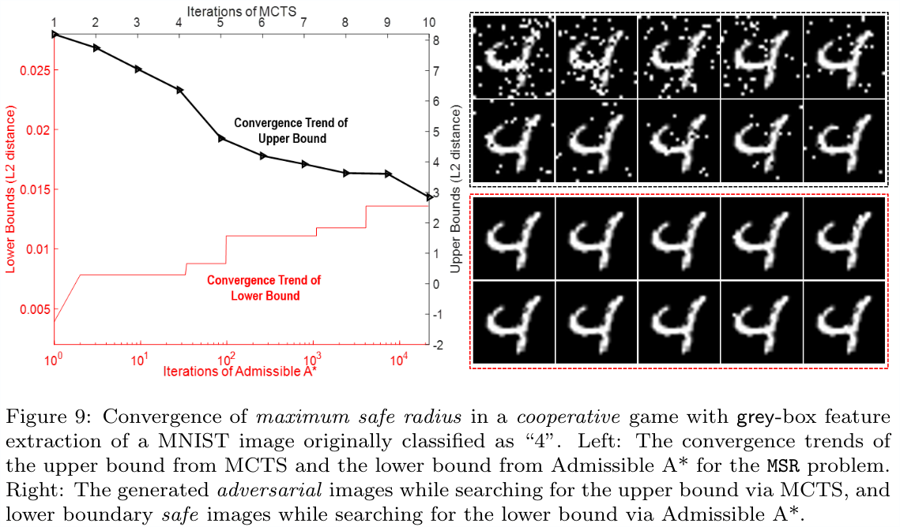
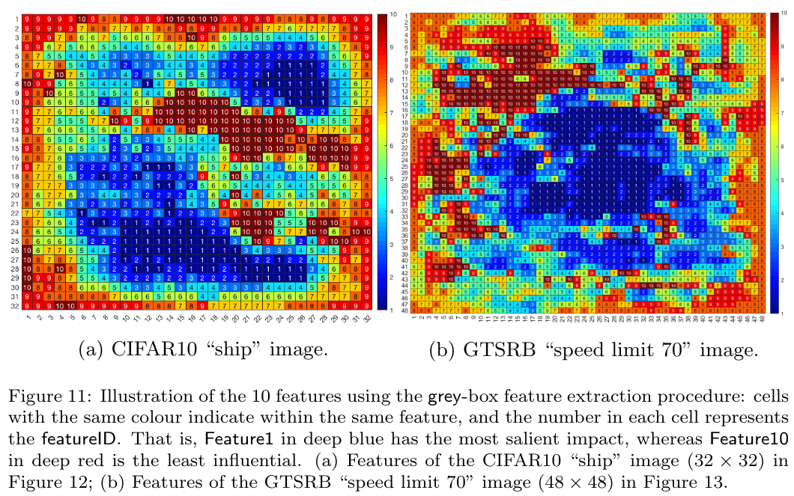

# Oxford AIMS CDT Systems Verification (HT, 2020)

## Lab Session: DeepGame

This is the webpage for the lab session of the AIMS CDT __Systems Verification__ course. 

To better understand the tool, feel free to look into the accompanying published paper: 
[A game-based approximate verification of deep neural networks with provable guarantees](https://www.sciencedirect.com/science/article/pii/S0304397519304426).

### 0. Installation of DeepGame

Download the __DeepGame__ tool from https://github.com/minwu-cs/DeepGame. In order to run the tool, _Python_ and some other packages such as _keras_ and _numpy_ need to be installed. 

Below is a list of the developer's platform for reference in case there is package inconsistency.

###### Developer's Platform
```
python 3.5.5
keras 2.1.3
tensorflow-gpu 1.4.0
numpy 1.14.3
matplotlib 2.2.2
scipy 1.1.0
```

Use the following command line to run DeepGame. 

###### Run
```
python main.py mnist ub cooperative 67 L2 10 1
```

Detailed explaination of each parameter is as follows.
- `main.py` is the main Python file. 
- `mnist` refers to the name of the MNIST dataset. It can be other datasets, such as `cifar10` and `gtsrb`.
- `ub` denotes upper bound. Use `lb` for lower bound.
- `cooperative` indicates the computation of the _maximum safe radius_ in a cooperative game. To compute the _feature robustness_, use `competitive` instead.
- `67` is the index of the image in the dataset.
- `L2` is short for the _L<sup>2</sup> norm_, i.e., the Euclidean distance. Use `L1` for the _L<sup>1</sup> norm_ (Manhattan distance), or `L0` for the Hamming distance.
- `10` gives the distance budget.
- `1` denotes the value of _atomic manipulation_ imposed on each pixel/channel of an image.

Alternatively, you may run DeepGame via the following command line, which allows a sequential execution of the above command line.
```
./commands.sh
```
-------------------


### 1. Robustness of Deep Neural Networks

The _maximum safe radius of a neural network with respect to an input_ is a distance such that, with imposed perturbations below the distance, all the input points are safe, whereas if above the distance, there definitely exists an adversarial example. To approximate the maximum safe radius, we compute the _lower and the upper bounds_ of it, and show the convergence trend.

#### Questions: 
> 1. Plot a figure to illustrate the convergence of the lower and upper bounds of the maximum safe radius. 
> _Requirements: (1) an image from the MNIST dataset with index from 0 to 99; (2) based on the Euclidean distance._

> 2. Exhibit some safe perturbations imposed on the original image corresponding to the lower bounds, and also some adversarial examples generated as a by-product when computing the upper bounds.

> 3. Change the value of _atomic manipulation_ in the range of (0,1], and observe its influence on the convergence of the lower annd upper bounds.

> 4. Explain the underly algorithms behind the computation of the bounds. For instance, the _Monte Carlo tree search_ algorithm to compute the upper bounds, and the _Admissible A*_ algorithm to compute the lower bounds.




-------------------

### 2. Adversarial Examples

-------------------

### 3. Generation of Saliency Maps




### Citation
